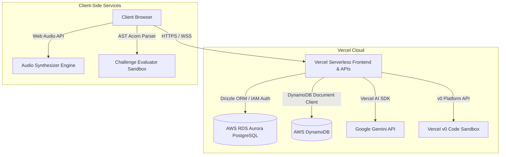

# 🧭 Silk Road: AI-Driven Software Engineering Trail

> **B2C AI Learning Expedition Platform**  
> Deployed on **Vercel** and powered by **AWS Serverless Databases** (RDS Aurora PostgreSQL + DynamoDB) & **Vercel AI SDK (Gemini)**.  
> *Developed for the Devpost Hackathon: Hack the Zero Stack with Vercel v0 and AWS Databases.*

---

## 🗺️ Product Overview & B2C Funnels

**Silk Road** turns the journey of learning software engineering into an epic caravan expedition across historic trade routes. Users ("Travelers") undergo AI skill diagnostic tests, unlock personalized learning paths represented as "Oases" on a custom interactive SVG map, maintain survival streaks through daily coding challenges, and trade knowledge in the "Great Bazaar" community.

### Key B2C Monetization Funnels (The "Caravan" Economy)
1. **Premium Expeditions (Roadmaps)**: AI-generated, mentor-certified custom learning paths based on onboarding diagnostics, bypassing foundational topics for advanced users.
2. **AI Caravan Master (Co-pilot)**: A historical tutoring guide (Master Marco Polo) assisting travelers with structured hints and pseudo-code without spoiling direct answers.
3. **The Caravanserai Marketplace**: Marketplace for custom project boilerplates, hiring verified expert guides (human mentors) for 1-on-1 sessions, and purchasing certifications.
4. **Survival Streaks (Gamification)**: Subscription tier giving travelers Role IQ ratings, daily challenge canteens, and the ability to purchase "Streak Shields" with Caravan Coins to save streaks.
5. **v0 Oasis Component Generator**: Premium React + Tailwind boilerplate generator leveraging the Vercel v0 API, offering a 1-time free trial (saved in `localStorage`) before prompting upgrade.
6. **Caravanserai Community Tipping**: Encourages knowledge sharing by enabling travelers to tip 10 Caravan Coins directly to forum posts, executing relational transactions via AWS Aurora.

---

## 🛠️ Technology Stack & Architecture

* **Frontend Framework**: Next.js 14+ (App Router) with React & TypeScript
* **Deployment & Hosting**: Vercel for Frontend and Serverless Functions
* **Styling**: Tailwind CSS with Custom Theme (Midnight Oasis & Desert Gold)
* **Relational Database**: AWS RDS Aurora (PostgreSQL Serverless v2) + Drizzle ORM
* **NoSQL Database**: AWS DynamoDB (for high-frequency streaks, logs, and progress tracking)
* **AI Engine**: Vercel AI SDK + Google Gemini API (`gemini-2.5-flash`)
* **AST Parser**: Acorn compiler for syntactic verification of student submissions
* **Code Compiler**: Isolated browser Web Workers with 2-second timeout limits

---

## 🎨 Visual Aesthetics & UX Highlights

To craft a stunning, immersive portal, Silk Road utilizes a desert-inspired cyberpunk aesthetic:

* **Desert Midnight Palette**: `#070F19` deep space background, `#0D1B2A` glassmorphic indigo panels, `#D4AF37` metallic gold primary accents, `#00A896` refreshing turquoise springs, and `#F26419` streak fire orange.
* **Interactive Path Traversal**: Generates custom SVG bezier curves connecting learning nodes, with a bobbing camel caravan animating along the path upon completion.
* **Canteen Streak Hydration**: A custom CSS keyframe-animated water bottle (canteen) whose water level dynamically reflects the active streak length, glowing gold at 7+ days.
* **Double-Column Synced Sandbox Gutter**: A custom height-constrained (`h-[480px]`) editor code box with double-column synchronous scroll mapping between line numbers and editor input.
* **Retro CRT Terminal Console**: Simulated UNIX CLI console for execution results complete with CRT scanline gradients, command outputs, and syntax checks.
* **Ambient Sound Engine**: Zero-dependency Web Audio API synthesizer generating looping ambient desert windscapes, compiler chime success bells, thud failure sound effects, and paper rustle chip ticks.
* **Responsive Drawer Compass**: On mobile viewports under `768px`, navigation folds into an adaptive menu, and the Caravan Master chat collapses into a floating compass opening a bottom sheet at 80% screen height.
---

## 🏛️ Application Architecture Diagram



---

## 🗄️ Database Schemas

### AWS Aurora PostgreSQL (Drizzle ORM)
Critical transactional ledger integrity is managed here:
* **`users`**: Traveler status, email, role, and Caravan Coin purse balances.
* **`mentors`**: Expert guide registrations, specialty bio descriptions, rates, and reviews.
* **`bookings`**: Session booking statuses, connection rooms, and scheduled times.
* **`transactions`**: Relational ledger auditing Caravan Coins purchases, community tips, and subscriptions.
* **`roadmaps`**: Meta definitions of AI-constructed learning routes.
* **`forumPosts`**: Caravanserai community forum threads.
* **`assessments`**: Role IQ diagnostic results, percentiles, and capability charts.

### AWS DynamoDB
Logs high-frequency, low-latency metrics:
* **`UserStreaks`**: Tracks daily completion timestamps, streak counts, and histories.
* **`UserProgress`**: Maps completed nodes and active paths.
* **`DailyChallengeLogs`**: Audit logs of code submissions, accuracy, and feedback context.

> [!TIP]
> **Graceful Offline Fallbacks**: If database credentials are not supplied, the backend falls back automatically to file-backed mock stores (`in-memory-db.json` and `in-memory-dynamodb.json`), allowing fully functional offline testing!

---

## 🚀 Getting Started

### 1. Configure Environment variables
Create a `.env.local` file in the root folder with the following variables:
```env
DATABASE_URL=postgres://<user>:<password>@<cluster-endpoint>:5432/postgres?sslmode=require
AWS_REGION=eu-north-1
AWS_ACCESS_KEY_ID=<your-aws-key>
AWS_SECRET_ACCESS_KEY=<your-aws-secret>
GEMINI_API_KEY=<comma-separated-rotated-gemini-keys>
V0_API_KEY=<vercel-v0-api-token>
```

### 2. Install Dependencies
```bash
npm install
```

### 3. Verify Database Integrity
To check the connection to AWS RDS Aurora PostgreSQL, retrieve table counts, or view seed data:
```bash
npm run db:check
```

### 4. Run Locally
Start the development server:
```bash
npm run dev
```
Open [http://localhost:3000](http://localhost:3000) to view the portal.

### 5. Build for Production
To verify typescript compiler checks and construct optimized production static bundles:
```bash
npm run build
```
